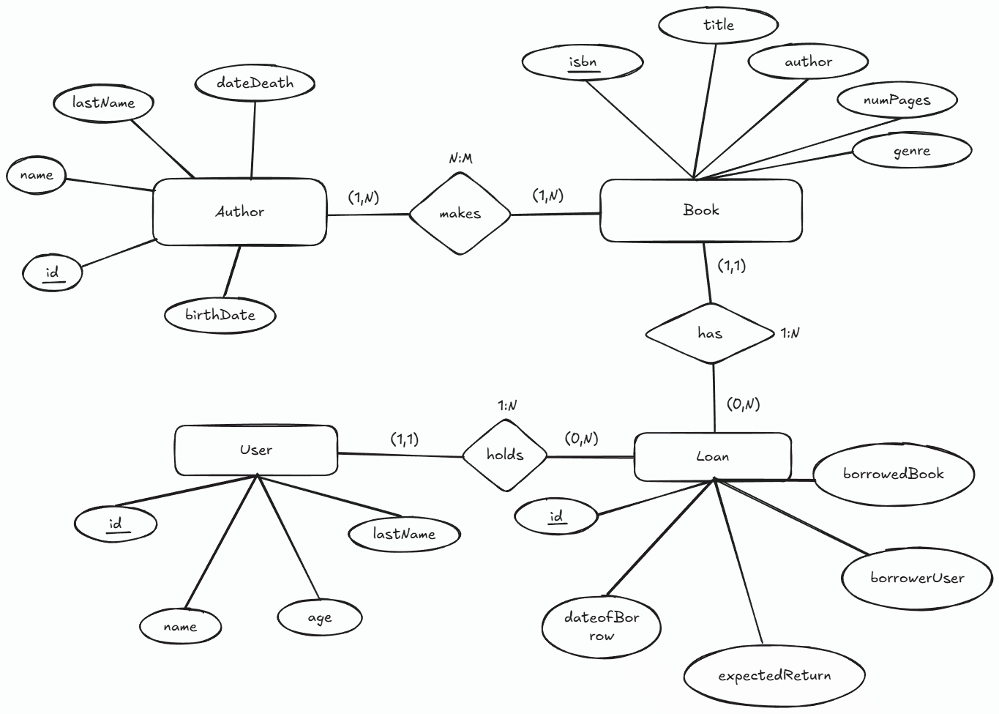

# Library Management CLI

A console-based application (CLI) for managing books in a library, developed with **Java** and following **Object-Oriented Programming (OOP)** principles. The application uses **SQLite** as the database to store information.

---

## 🗂 Database Structure
### E-R Diagram
  

---

## 🛠 Technologies Used

- **Language:** Java (OOP)  
- **Database:** SQLite  
- **Tools:** JDBC for SQLite connection  
- **Development Environment:** Eclipse IDE
